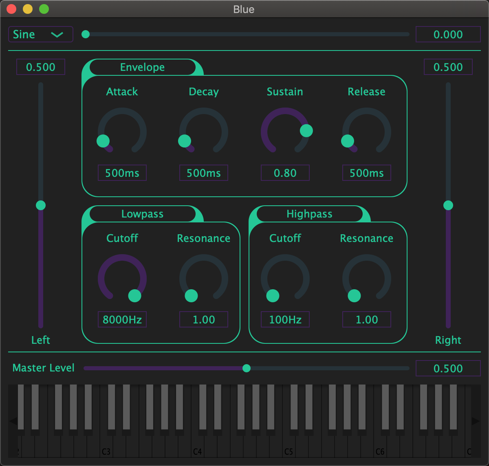

# Blue

A polyphonic, MIDI capable audio synthesizer. Written with the JUCE audio framework.

### A snapshot of the Synth

### Use

Run Builds/[your environment]/build/Release/Blue

For information on audio synthesis, see [Synthesis Fundamentals courtesy of Moog](https://moogfoundation.org/learning-synthesis/synthesis-fundamentals/)

### Development

Written in C++.

Dependencies: 

* JUCE Audio Framework

## Author

Noah Tigner

nzt@cs.uoregon.edu

